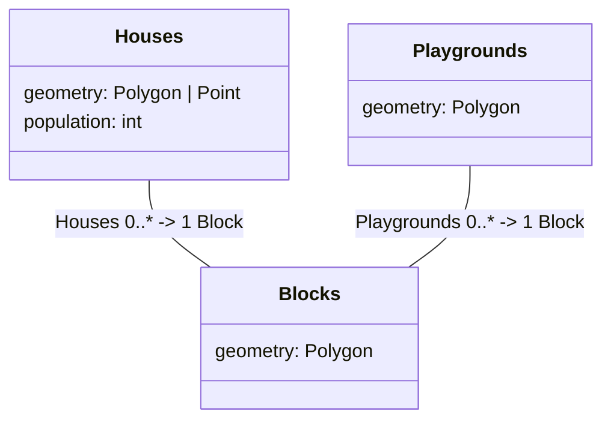

### Input data

```mermaid
classDiagram
  class Houses {
    geometry: Polygon | Point
    population: int
  }

  class Playgrounds {
    geometry: Polygon
  }
  
  class Blocks {
    geometry: Polygon
  }

Houses -- Blocks: Houses 0..* -> 1 Block
Playgrounds -- Blocks: Playgrounds 0..* -> 1 Block
```
